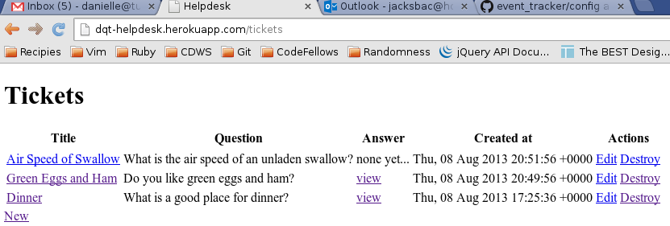

# HelpDesk

By [Danielle Tucker](http://www.linkedin.com/in/dqtucker/).

## Description
**HelpDesk** is a mini app developed to work with sending and recieving email
by an application as well as working with postgresql for the entire development
cycle.

The live app can be found at [http://dqt-helpdesk.herokuapp.com/](http://dqt-helpdesk.herokuapp.com/)

## Information

Screenshots of the application are below:

Main Screen...

After a new ticket is created and an email has been recieved by the app...

### Installation
This app requires that you have postgres installed on your local system with a
database called helpdesk_development and helpdesk_test along with an appropiate user.
Make sure you update your database.yml file to reflect this or use foremen and a .env file
with the appropiate ENV variables.

App Secret Key:  Your own secret key must be included in the .env file which can be 
generated by running `rake secret`. See .env_example for an example of what the file
should look like.

### Known Issues

If you discover any bugs, feel free to create an issue on GitHub fork and
send us a pull request.

### Contributing

1. Fork it
2. Create your feature branch (`git checkout -b my-new-feature`)
3. Commit your changes (`git commit -am 'Add some feature'`)
4. Push to the branch (`git push origin my-new-feature`)
5. Create new Pull Request

### License

The MIT License
